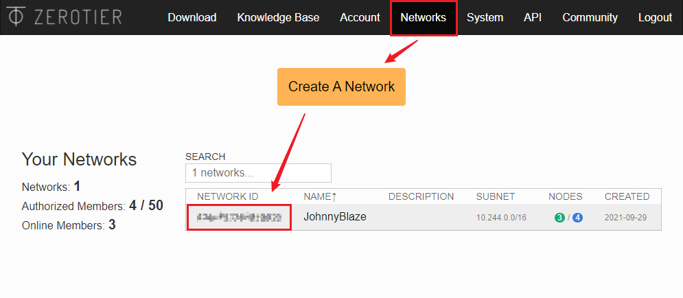
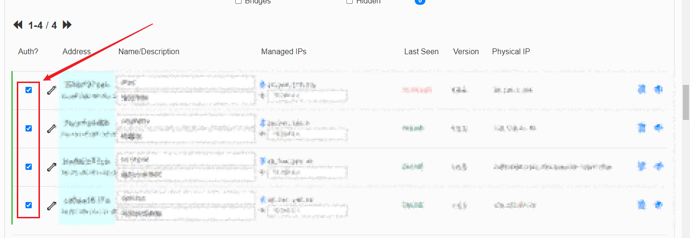

# 基于ZeroTier实现内网穿透

### 我的需求背景

想组建自己的家庭内网供影音和离线下载等需求，但是苦于家庭网络无法获取到公网IP，无法随时访问到自己的服务器；

### ZeroTier介绍

`ZeroTier` 是一款基于 `P2P` 技术的简单易用的内网穿透工具，它可以实现在任何有网络的地方，都可以连接到家里、公司、学校的设备，而无需公网 IP 和复杂端口转发配置; [点我访问官网地址](https://www.zerotier.com/)

### ZeroTier安装配置

> 由于本文档具有一定失效性，强烈建议此处参考官网引导：[引导地址](https://www.zerotier.com/download/)

ZeroTier整体配置流程非常简单，大体可以分为：

1. 创建ZeroTier账号，[点我访问官网地址](https://www.zerotier.com/)，创建个人网络，点击 `Create A Network` 按钮后，下方会下出现一个新的网络

2. 复制第二步获取的 `NETWORK ID`, 在需要互通的设备安装zerotier客户端，并加入到复制的网络ID中；[点我下载APP](https://www.zerotier.com/download/)

3. 检查ZeroTier控制面板的设备列表前的CheckBox，以允许新设备访问网络

在设备上启动任意网站，即可通过其他局域网内设备访问